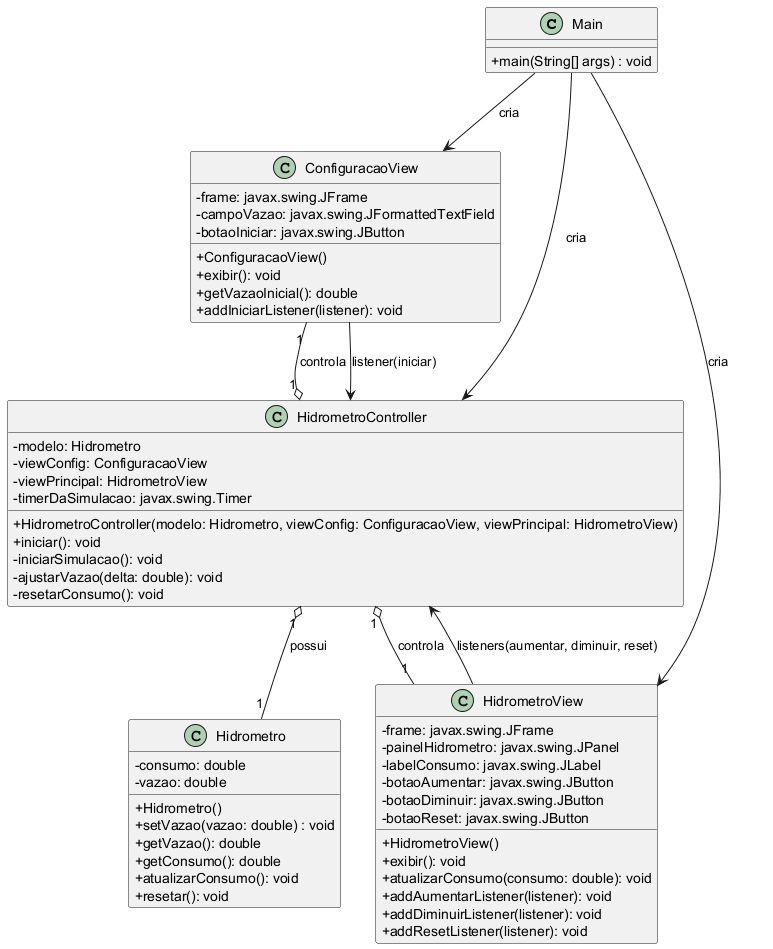

# Simulador de Hidrômetro

Este repositório contém um simulador de hidrômetro em Java e diagramas do fluxo principal da aplicação.

**Arquivos de diagrama criados**

- `diagrama_flowchart.puml` — diagrama em PlantUML
- `diagrama_flowchart.md` — diagrama em Mermaid dentro de Markdown

**Visualizar os diagramas**

- Para ver o PlantUML no VS Code, instale a extensão *PlantUML* e abra `diagrama_flowchart.puml`.
- Para ver o Mermaid no VS Code, use a pré-visualização Markdown (ou extensões que suportem Mermaid) e abra `diagrama_flowchart.md`.

**Renderizar imagens localmente (PowerShell)**

O script `render_diagrams.ps1` automatiza a geração de imagens a partir do PlantUML se você tiver o `plantuml.jar` e Java instalados, ou usando Docker.

Exemplos de uso (PowerShell):

- Usando `plantuml.jar`:

```powershell
# Gera PNG a partir do .puml
.\render_diagrams.ps1 -PlantUmlJarPath "C:\path\to\plantuml.jar" -OutputFormat png
```

- Usando Docker (se tiver Docker):

```powershell
.\render_diagrams.ps1 -UseDocker -OutputFormat svg
```

**Diagrama Mermaid (rápido)**

Veja `diagrama_flowchart.md` para o diagrama em Mermaid (útil para visualização rápida no Markdown).

---

Se quiser, eu posso:

- Gerar as imagens (`png`/`svg`) automaticamente aqui se você permitir que eu rode comandos (posso tentar executar `java -jar plantuml.jar` se o `plantuml.jar` estiver disponível),
- Inserir o diagrama renderizado no `README.md` como imagem (após gerar os arquivos PNG/SVG),
- Ajustar o nível de detalhe dos diagramas (nomes de métodos, parâmetros, etc.).

## Diagramas renderizados

Aqui estão as imagens geradas a partir dos arquivos PlantUML no repositório:



Legenda: Diagrama de classes com atributos privados e métodos públicos.


Legenda: Fluxo principal da aplicação (inicialização, loop do timer e ações do usuário).
