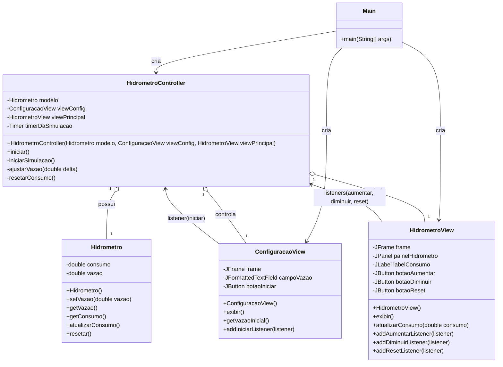

# Diagrama de Classes — Simulador de Hidrômetro

Diagrama de classes simplificado em Mermaid para leitura rápida.

```mermaid
classDiagram
    class Main {
        +main(String[] args)
    }

    class Hidrometro {
        -double consumo
        -double vazao
        +Hidrometro()
        +setVazao(double vazao)
        +getVazao()
        +getConsumo()
        +atualizarConsumo()
        +resetar()
    }

    class ConfiguracaoView {
        -JFrame frame
        -JFormattedTextField campoVazao
        -JButton botaoIniciar
        +ConfiguracaoView()
        +exibir()
        +getVazaoInicial()
        +addIniciarListener(listener)
    }

    class HidrometroView {
        -JFrame frame
        -JPanel painelHidrometro
        -JLabel labelConsumo
        -JButton botaoAumentar
        -JButton botaoDiminuir
        -JButton botaoReset
        +HidrometroView()
        +exibir()
        +atualizarConsumo(double consumo)
        +addAumentarListener(listener)
        +addDiminuirListener(listener)
        +addResetListener(listener)
    }

    class HidrometroController {
        -Hidrometro modelo
        -ConfiguracaoView viewConfig
        -HidrometroView viewPrincipal
        -Timer timerDaSimulacao
        +HidrometroController(Hidrometro modelo, ConfiguracaoView viewConfig, HidrometroView viewPrincipal)
        +iniciar()
        -iniciarSimulacao()
        -ajustarVazao(double delta)
        -resetarConsumo()
    }

    Main --> HidrometroController : cria
    Main --> ConfiguracaoView : cria
    Main --> HidrometroView : cria
    HidrometroController "1" o-- "1" Hidrometro : possui
    HidrometroController "1" o-- "1" ConfiguracaoView : controla
    HidrometroController "1" o-- "1" HidrometroView : controla
    ConfiguracaoView --> HidrometroController : listener(iniciar)
    HidrometroView --> HidrometroController : listeners(aumentar, diminuir, reset)
```

Use a visualização Markdown no VS Code para ver este diagrama em formato gráfico.
