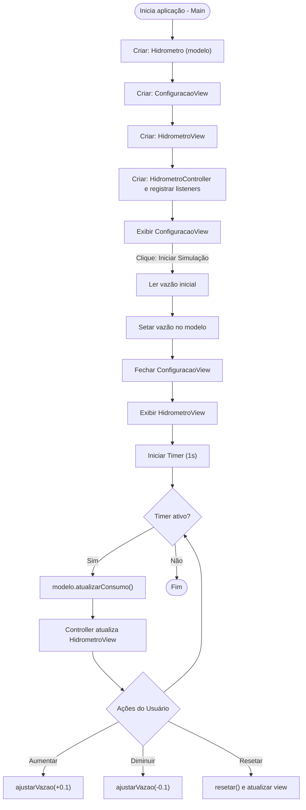

# Diagrama Flowchart — Simulador de Hidrômetro

Abaixo seguem dois formatos de diagrama para o projeto: PlantUML e Mermaid.

## Mermaid

## Como visualizar
- Para visualizar o `diagrama_flowchart.puml`, use uma ferramenta PlantUML (VS Code PlantUML extension).
- Para visualizar `diagrama_flowchart.md`, abra no VS Code com suporte a Mermaid (p.ex. Markdown Preview Enhanced).
